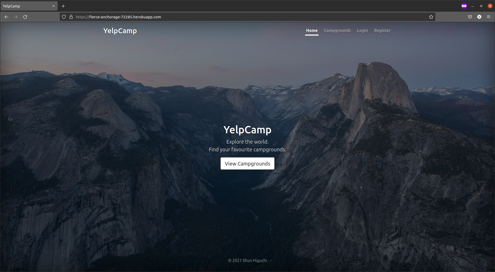
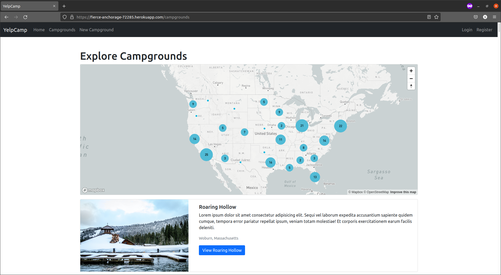
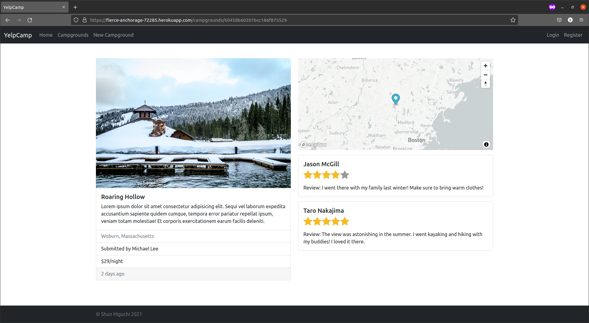
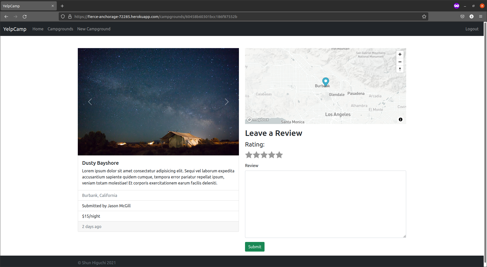

# YelpCamp

YelpCamp provides avid campers a platform to share their fabourite campgrounds and find the next destination.

Get started: [YelpCamp](https://fierce-anchorage-72285.herokuapp.com/).

## Features

- Users can create, edit, and delete campgrounds.
- Users can leave reviews on campgrounds.
- Users can find campgrounds via an interactive map.

## Technologies

- Node.js
- Express.js
- MongoDB

## Gallery

## Notes

This website was developed as part of [the Web Developer Bootcamp 2020/2021 by Colt Steele](https://www.udemy.com/course/the-web-developer-bootcamp/).
